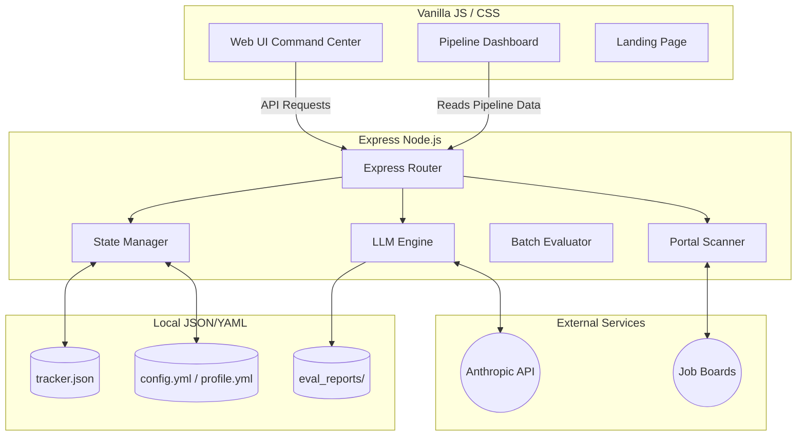

# AutoApply

AutoApply is a highly-automated, open-source AI job search command center. It evaluates job descriptions, manages a background portal scanner, generates tailored LaTeX resumes, drafts outreach emails, and tracks your application pipeline automatically.

It was heavily inspired by the CLI tool `career-ops`, but entirely reimagined into a sleek, modern WebUI dashboard tailored for the modern tech job market.

## Features

- **JD Evaluation:** Paste a job link or description. Get a 10-dimension match score, an A-F grade, and a go/no-go recommendation based on your specific CV.
- **Background Portal Scanner:** Recursively scrapes Lever, Greenhouse, Workday, and Ashby portals to detect new jobs.
- **Dynamic LaTeX CVs:** Dynamically curates bullets from your Master CV and outputs ATS-safe LaTeX templates.
- **Smart Follow-Up Cadence:** Recommends exact business days to follow-up on "ghosted" applications and generates the emails.
- **Interview & Outreach Prep:** Automatically writes personalized 7-word-subject cold emails and extracts STAR method behavioral questions based on the company's core values.
- **Rejection Analysis Engine:** Analyzes your failed applications to identify funnel bottlenecks and suggests strategic pivots.
- **Local & Private:** Everything runs on your machine. Your tracking data stays in local files.

## Architecture

AutoApply uses a lightweight client-server model designed to run locally.



## Tech Stack

- **Frontend:** Vanilla HTML, CSS (Custom Glassmorphism Design System), JavaScript
- **Backend:** Node.js, Express.js
- **AI Integration:** Anthropic API (Claude 3.5 Sonnet used for advanced JSON structured data extraction)
- **Data Persistence:** JSON and YAML files (No heavy database required, simple and trackable via Git)
- **Scraping:** Puppeteer / Cheerio (for fetching job descriptions and finding active portals)

## Installation & Setup

1. **Clone the repository:**
   ```bash
   git clone https://github.com/raiigauravv/AutoApply.git
   cd AutoApply
   ```

2. **Install dependencies:**
   ```bash
   npm install
   ```

3. **Configure your API keys:**
   Copy the example environment file and insert your API key.
   ```bash
   cp .env.example .env
   # Open .env and add ANTHROPIC_API_KEY=your_key_here
   ```

4. **Start the Command Center:**
   ```bash
   npm run dev
   # Or just run: node server.js
   ```

5. **Open the App:**
   Navigate to `http://localhost:3773` in your browser. From there, set up your profile, upload your Master CV, and start evaluating JDs.

## Project Structure

```text
autoapply/
├── public/                 # Static assets, Landing page, Dashboard UI, CSS
├── routes/                 # Express API routes
│   ├── apply.js            # Automated application answering
│   ├── evaluate.js         # Core JD Evaluation logic
│   ├── followup.js         # Follow-up cadence calculation
│   ├── latex.js            # LaTeX CV Generator
│   ├── liveness.js         # Job liveness status checks
│   ├── patterns.js         # Rejection pattern analyzer
│   ├── scan.js             # Portal scanner
│   └── tracker.js          # Pipeline persistence logic
├── config/                 # User settings, scoring weights, portals list
├── data/                   # The local "database" (tracker.json, etc.)
├── output/                 # Generated .tex and PDF resumes
├── reports/                # Saved JSON evaluation reports
├── server.js               # Express application entrypoint
└── claude.js               # LLM integration library
```

## Contribution
AutoApply is completely open-source. Feel free to submit pull requests for new portal scrapers, different LLM providers (e.g. OpenAI/Ollama), or new UI features.

## License
MIT License.
